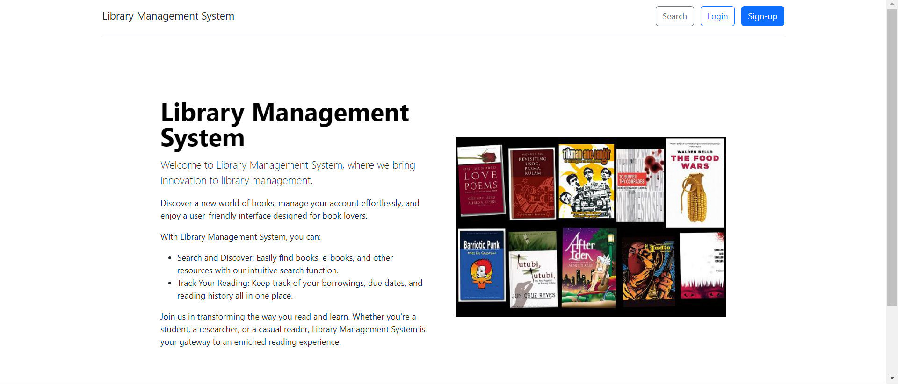
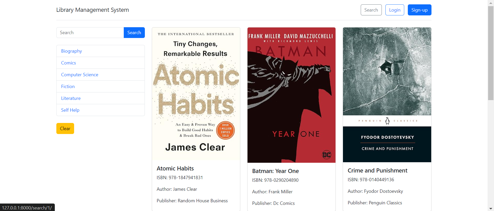
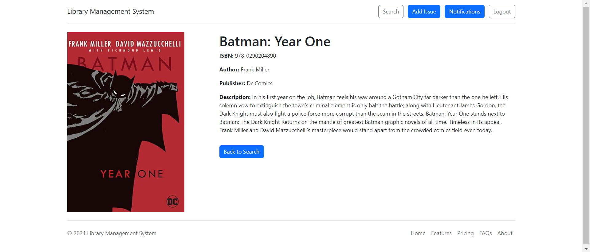
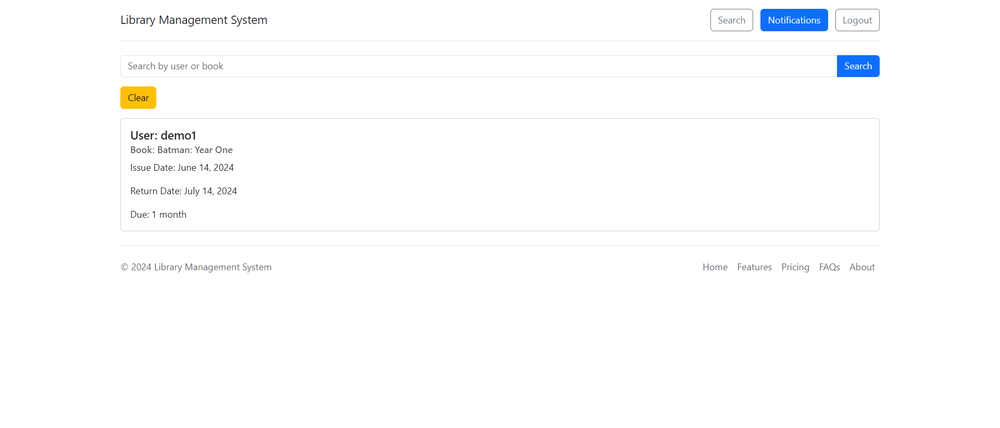
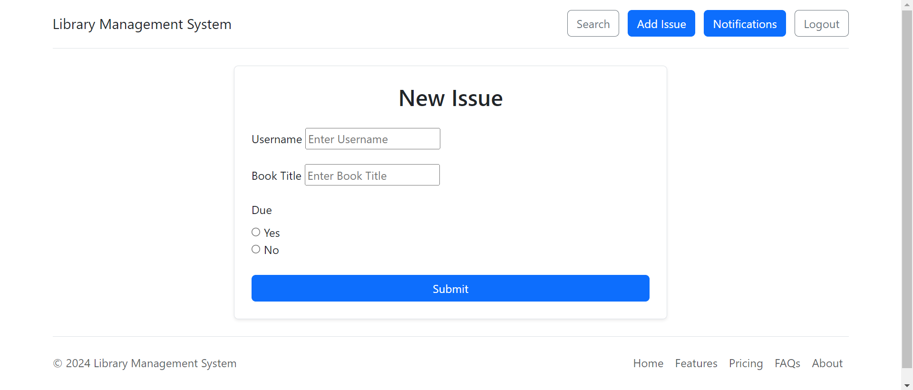
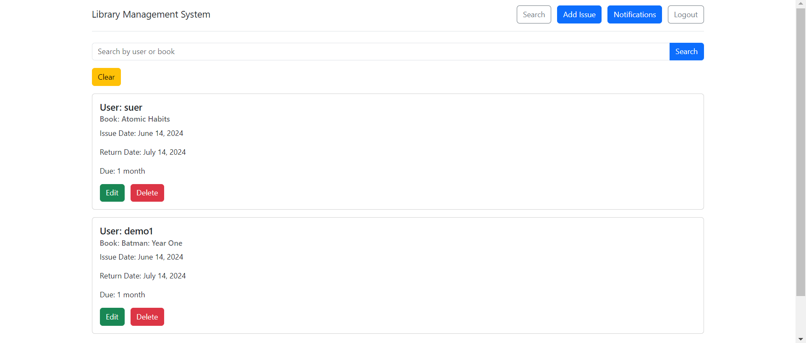
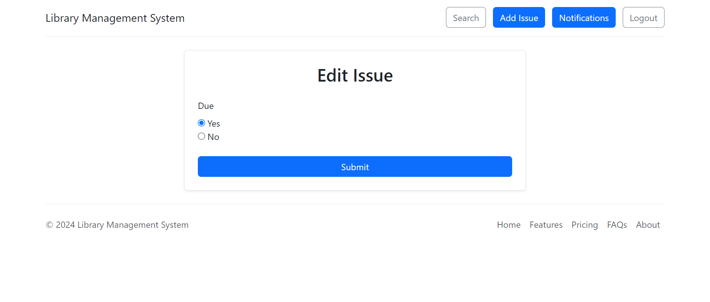

# Library Management System

## Description

Library Management System is designed to automate library operations. It assists librarians in managing book inventory, issuing books, tracking records, and retrieving issue history. It also allows users to search for books, and view their borrowing history.


## Features

### Admin or superuser

- Add Books and Categories.
- Add Staff Users.

### Staff

- Issue books to users/students.
- Edit or delete book issuance.
- View overdue users.
- View borrowing history of users.

### Non-Staff/Student

- Search for books.
- View overdue books.
- View borrowing history.

**Note:** Regular users (or non-staff members) can register themselves. Staff members are registered by an admin or superuser. Both staff and non-staff users can log in to the system.


## Getting Started

### Prerequisites 

- Ensure you have Python installed on your computer.

### Installation

1. Clone the repository.
```sh
        git clone https://github.com/krishnasree5/library-management-system-ii.git`
        cd library-management-system-ii
```
2. Create a virtual environment by running:
```sh
        cd library
        python3 -m venv venv
        source venv/bin/activate
```
3. Run Django server:
```sh
        python3 manage.py runserver
```
4. Go to http://127.0.0.1:8000/ on your browser.


## Images

<br>
<br>
<br>
<br>
<br>
<br>

